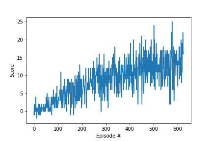

[//]: # (Image References)

[image1]: https://user-images.githubusercontent.com/10624937/42135619-d90f2f28-7d12-11e8-8823-82b970a54d7e.gif "Trained Agent"

# Project 1: Navigation Report

![image2][image1]

### Methodology

A deep Q network (DQN) was developed to map the 37 dimensions of the state space to one of the four actions. This was done by passing the state through two 64 node hidden layers then mapping that into an output layer the size of our unique action space. The hidden layers use rectified linear unit activation functions (ReLU) in order to always map the values to positive values.

Experience replay buffer was used in order to randomly sample past experiences to influence policy updates. This can prevent the agent from learning a local maxima/minima that prevents it from improving with additional training.

Epsilon-greedy action selection was implementented in order to maintain a balance of exploration while training the model.

### Parameters

These are the agent specific parameters used for this project:

```
BUFFER_SIZE = int(1e5)  # replay buffer size
BATCH_SIZE = 64         # minibatch size
GAMMA = 0.99            # discount factor
TAU = 1e-3              # for soft update of target parameters
LR = 5e-4               # learning rate 
UPDATE_EVERY = 4        # how often to update the network
```

The `BUFFER_SIZE` defines the max length of the replay buffer.

The `BATCH_SIZE` defines how many experiences from the replay buffer to learn from.

The `GAMMA` value defines the discount factor applied to weight actions taken early into training more when updating the policy.

The `TAU` value defines the rate of mixing the local 
parameters into the target parameters for soft updating.

The `LR` value defines the step size for the solver utilized.

The `UPDATE_EVERY` value defines how often the local network parameters are updated.

These are the specific parameters use for training the agent:
```
n_episodes = 1800 # maximum number of training episodes
max_t = 200       # maximum number of timesteps per episode
eps_start = 1.0   # starting value of epsilon, for epsilon-greedy action selection
eps_end = 0.01    # minimum value of epsilon
eps_decay = 0.995 # multiplicative factor (per episode) for decreasing epsilon
```

The `n_episodes` value dictates the maximum number of training episodes if a solution does not meet the pass criteria.

The `max_t` value dictates how long to run the agent in the environment for each episode.

The `eps_start`, `eps_end`, and `eps_decay` are the values used to define the epsilon greedy policy and how it decays as training progresses. This will encourage more exploration early into training and less as the training progresses.

### Results

The agent was able to exceed the desired average reward of 13 in 625 episodes. The plot below shows the average reward as the agent trained over the 625 episodes.



Throughout working on the project, these parameter settings have solved the environment in a range of as little as 400 episodes and as much as a bit less than 800. However, it has consistently completed training well under the objective 1800 episodes. All in all, the DQN algorithm was very successful at solving for a policy capable of consistently performing well in the Bananas Unity Environment.

### Future Improvements

The first change I would make to attempt to improve learning and solve in less episodes would be to modify the training hyperperameters, such as the epsilon greedy decay, and the agent parameters, such as the buffer size and update rate. These parameters were mostly inherited from an example and could be tailored to optimize performance for this implementation.

Another possible improvement would be to implement a double DQN or a dueling DQN. The double DQN could help with the overestimation problem commonly observed for standard DQN and the dueling DQN could help by seperating the Q definition into two networks, one for the state value function and one for the action advantage. Another improvement worth investigating is prioritized experience replay, which would allow the replay buffer to store the most useful experiences based on error instead of only storing they most recent experiences regardless of their error. 

After incorporating these improvements, one could also consider implementing Rainbow developed by Google DeepMind as it would outperform any of the DQN improvements on their own and possibly the combination of the three mentioned above.
