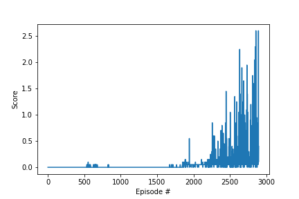
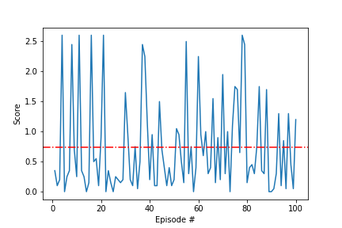

[//]: # (Image References)

[image1]: https://user-images.githubusercontent.com/10624937/42135623-e770e354-7d12-11e8-998d-29fc74429ca2.gif "Trained Agent"

# Project 3: Collaborate and Compete Report

![Trained Agent][image1]

### Methodology

The Deep Deterministic Policy Gradient (DDPG) algorithm utilized in the bipedal example was modified in order to solve the reacher Unity environment. The solution from the second project was then directly utilized with the environment for this project to see how it would perform. This report will include the results for the given environment implemented in a windows 64 bit machine. This environment is unique when compared to the previous project as it has multiple agents but they are cooperating to maximize the reward instead of only influencing their local agents reward.

DDPG is an Actor-Critic reinforcement learning policy. It utilizes two neural networks: one for the actor and one for the critic. The actor develops a policy for mapping observations to actions for the given environment. The critic evaluates the actions of the actor by estimating the expected return.

The actor network consists of two layers of 256 neurons. The two layers are fully connected and map the input observation features to the action space. The first layer utilizes a ReLU activation function; while the second layer utilizes a Tanh activation function in order to bound the output between [-1, 1].

The critic network consists of 4 full connected layers. The first and second layer have 256 neurons and the third has 128. The first layer utilizes a leaky ReLU activation function. The output of this is concatenated with the action featurs and then passed through the next two layers utilizng leaky ReLU activation functions. The final layer outputs the single value representing the estimated Q value.

Experience replay buffer was used in order to randomly sample past experiences to influence policy updates. This can prevent the agent from learning a local maxima/minima that prevents it from improving with additional training.

### Parameters

These are the agent specific parameters used for this project:

```
BUFFER_SIZE = int(1e5)  # replay buffer size
BATCH_SIZE = 128        # minibatch size
GAMMA = 0.99            # discount factor
TAU = 1e-3              # for soft update of target parameters
LR_ACTOR = 1e-4         # learning rate of the actor 
LR_CRITIC = 3e-4        # learning rate of the critic
WEIGHT_DECAY = 0.0      # L2 weight decay
```

The `BUFFER_SIZE` defines the max length of the replay buffer.

The `BATCH_SIZE` defines how many experiences from the replay buffer to learn from.

The `GAMMA` value defines the discount factor applied to weight actions taken early into training more when updating the policy.

The `TAU` value defines the rate of mixing the local 
parameters into the target parameters for soft updating.

The `LR_ACTOR` value defines the step size for the solver utilized for the actor.

The `LR_CRITIC` value defines the step size for the solver utilized for the critic.

The `WEIGHT_DECAY` helps prevent overfitting by penalizing large weights.

These are the specific parameters use for training the agent:
```
n_episodes = 5000   # maximum number of training episodes
max_t = 1000        # maximum number of timesteps per episode
```

The `n_episodes` value dictates the maximum number of training episodes if a solution does not meet the pass criteria.

The `max_t` value dictates how long to run the agent in the environment for each episode if done criteria not met.

### Results

The agent was able to exceed the desired average reward of 0.5 in 2894 episodes. The plot below shows the average reward for each episode of training.



The testing resulted in the agent achieving an average score of 0.74 over the 100 testing episodes. This did meet the desired performance but did take a considerable amount of episodes and wall time to train a successful agent. All in all, the DDPG algorithm was very successful at solving for a policy capable of consistently performing well in this modified tennis Unity Environment. The testing scores observed during testing the agent from the above training is included below.



### Future Improvements

The first change I would make to attempt to improve learning and solve in less episodes would be to modify the training hyperperameters, such as the weight decay, and the agent parameters, such as the buffer size. These parameters were kept the same as what was utilized in the second project but are likely far from optimized values and, in the case of the weight decay, remove functionality by setting the value to zero. Performing a trade study varying a few of these parameters independently and coupled could provide valuable insight into how their values impact performance.

Another possible improvement would be to implement Proximal Policy Optimization (PPO). PPO might take a bit of work to get training effectively but could result in quicker training to surpass the desired score when fine tuned.